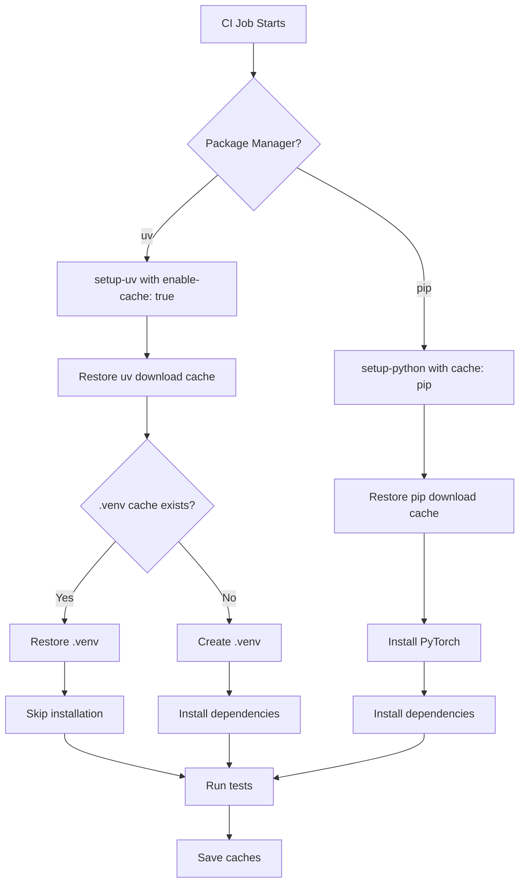

# Design Document: CI Caching

## Overview

This design implements a two-layer caching strategy for GitHub Actions CI workflows to reduce build times and PyPI load. The implementation uses official GitHub Actions caching mechanisms: `actions/setup-python@v5` with built-in pip caching, `astral-sh/setup-uv@v7` with built-in package download caching, and `actions/cache@v4` for virtual environment caching.

The design addresses the project's unique constraints: matrix testing with both pip and uv package managers, CPU and GPU PyTorch variants, and the current PyTorch installation workaround that prevents using standard lock files.

## Architecture

### Caching Layers

**Layer 1: Package Download Cache**
- Caches downloaded package files from PyPI
- Managed by package manager-specific actions
- Reduces network traffic and PyPI load
- Shared across all jobs using the same package manager

**Layer 2: Virtual Environment Cache**
- Caches installed packages in .venv directory (uv only)
- Skips installation when dependencies unchanged
- Provides maximum speed improvement
- Platform-specific (separate for ubuntu-latest and AWS GPU runners)

### Cache Flow



### Cache Key Strategy

**Pip cache key** (managed by actions/setup-python):
- Automatically generated from requirements files
- Format: `setup-python-{runner.os}-pip-{hash(requirements)}`

**UV download cache key** (managed by astral-sh/setup-uv):
- Automatically managed by the action
- Persists across workflow runs

**UV .venv cache key** (manual implementation):
- Format: `uv-venv-{runner.os}-{device}-{hashFiles('uv.lock')}`
- Includes runner.os for platform separation
- Includes device (cpu/gpu) for PyTorch variant separation
- Based on uv.lock hash for reproducibility

## Components and Interfaces

### Modified Workflows

**install-and-test.yml**
- Add pip caching to pip matrix jobs
- Add uv download caching to uv matrix jobs
- Add .venv caching to uv matrix jobs
- Preserve existing test data caching
- Maintain CPU/GPU and pip/uv matrix structure

**pre-commit.yml**
- Add pip caching for pre-commit dependencies
- Maintain Python version matrix (3.10-3.14)

### GitHub Actions Integration

**actions/setup-python@v5** (for pip jobs):
```yaml
- uses: actions/setup-python@v5
  with:
    python-version: 3.13
    cache: 'pip'
```

**astral-sh/setup-uv@v7** (for uv jobs):
```yaml
- uses: astral-sh/setup-uv@v7
  with:
    enable-cache: true
```

**actions/cache@v4** (for .venv caching):
```yaml
- uses: actions/cache@v4
  with:
    path: .venv
    key: uv-venv-${{ runner.os }}-${{ matrix.device }}-${{ hashFiles('uv.lock') }}
    restore-keys: |
      uv-venv-${{ runner.os }}-${{ matrix.device }}-
```

## Data Models

### Cache Metadata

```yaml
CacheEntry:
  key: string              # Unique cache identifier
  version: string          # Cache version (compression + paths)
  scope: string            # Branch scope
  size: integer            # Cache size in bytes
  created_at: timestamp    # Creation time
  last_accessed: timestamp # Last access time
```

### Workflow Matrix

```yaml
Matrix:
  package_manager: [pip, uv]
  device: [cpu, gpu]
  runner:
    cpu: ubuntu-latest
    gpu: cirun-aws-runner--${{ github.run_id }}
  torch_index:
    cpu: https://download.pytorch.org/whl/cpu
    gpu: https://download.pytorch.org/whl/cu128
```

## Correctness Properties

*A property is a characteristic or behavior that should hold true across all valid executions of a system—essentially, a formal statement about what the system should do. Properties serve as the bridge between human-readable specifications and machine-verifiable correctness guarantees.*

### Property 1: Package Download Cache Reuse

*For any* CI workflow run with unchanged dependencies, the package download cache should be restored and reused, avoiding re-downloading packages from PyPI.

**Validates: Requirements 1.1, 2.3, 3.3, 8.5**

### Property 2: Virtual Environment Cache Reuse

*For any* CI workflow run using uv with unchanged uv.lock, the .venv directory should be restored from cache, skipping package installation.

**Validates: Requirements 1.2, 4.3**

### Property 3: Cache Invalidation on Dependency Change

*For any* CI workflow run where dependencies have changed (uv.lock modified), both package download cache and .venv cache should be invalidated and rebuilt from scratch.

**Validates: Requirements 1.3, 4.4, 9.4**

### Property 4: Multi-Package-Manager Cache Support

*For any* package manager (pip or uv), the CI system should successfully cache and restore downloaded packages across workflow runs.

**Validates: Requirements 1.5**

### Property 5: Lock File Generation

*For any* CI workflow run using uv where uv.lock does not exist, the system should generate uv.lock before computing cache keys.

**Validates: Requirements 5.4**

### Property 6: PyTorch Variant Compatibility

*For any* PyTorch variant (CPU or GPU), the CI system should successfully cache and restore dependencies with the correct PyTorch index URL.

**Validates: Requirements 6.2**

### Property 7: Cache Hit Performance Improvement

*For any* CI workflow run with cache hit, dependency installation time should be measurably faster than a run with cache miss.

**Validates: Requirements 9.1**

### Property 8: Cache Miss Resilience

*For any* CI workflow run with cache miss (empty cache), the build should complete successfully by installing all dependencies from scratch.

**Validates: Requirements 9.2**

### Property 9: No Stale Dependency Failures

*For any* CI workflow run using cached dependencies, the cached environment should produce identical test results to a fresh installation with the same dependency specifications.

**Validates: Requirements 9.5**

### Property 10: Existing Functionality Preservation

*For any* existing test suite (install-and-test.yml or pre-commit.yml), all tests should pass with caching enabled, maintaining the same pass/fail results as without caching.

**Validates: Requirements 7.4, 7.5, 7.6, 8.4, 9.3**

## Error Handling

### Cache Restoration Failures

**Scenario:** Cache key exists but restoration fails (corrupted cache, network issues)

**Handling:**
- GitHub Actions automatically treats failed cache restoration as cache miss
- Workflow continues with fresh installation
- No manual intervention required
- Log warning for debugging

### Lock File Generation Failures

**Scenario:** uv.lock generation fails due to dependency conflicts

**Handling:**
- Fail the workflow with clear error message
- Display uv resolver output showing conflicts
- Require developer to resolve conflicts locally
- Do not proceed with invalid dependency state

### Cache Size Limits

**Scenario:** Cache exceeds GitHub's 10GB limit per repository

**Handling:**
- GitHub Actions automatically evicts oldest caches
- Use restore-keys for fallback to partial cache matches
- Monitor cache sizes in workflow logs
- Consider cache key strategy adjustments if limits hit frequently

### Platform-Specific Cache Mismatches

**Scenario:** Cache from one runner OS used on different OS

**Handling:**
- Include runner.os in all cache keys
- Prevents cross-platform cache pollution
- Each platform maintains separate caches
- No fallback to different OS caches

### PyTorch Variant Cache Conflicts

**Scenario:** CPU cache used for GPU job or vice versa

**Handling:**
- Include device type in cache keys
- Separate caches for cpu and gpu variants
- Prevents incorrect PyTorch installation
- Each variant rebuilds if cache missing

### Stale Lock File

**Scenario:** uv.lock exists but doesn't match pyproject.toml

**Handling:**
- Regenerate uv.lock in CI before caching
- Use `uv lock --upgrade` to sync with pyproject.toml
- Cache key based on regenerated lock file
- Ensures cache matches actual dependencies

## Testing Strategy

### Dual Testing Approach

This feature requires both unit tests and property-based tests for comprehensive validation:

**Unit Tests:**
- Specific workflow configuration examples
- YAML syntax validation
- Cache key format verification
- Documentation completeness checks
- Edge cases (missing lock files, empty caches)

**Property Tests:**
- Cache behavior across multiple workflow runs
- Performance improvements with cache hits
- Correctness with different dependency sets
- Cross-platform cache isolation
- Package manager compatibility

### Property-Based Testing Configuration

**Testing Library:** Use pytest with hypothesis for property-based testing

**Test Configuration:**
- Minimum 100 iterations per property test
- Each test tagged with: **Feature: ci-caching, Property {N}: {property_text}**
- Use GitHub Actions workflow runs as test subjects
- Generate varied dependency configurations for testing

### Test Scenarios

**Scenario 1: Fresh Build (No Cache)**
- First workflow run on new branch
- Verify all dependencies installed from scratch
- Verify caches saved for future runs
- Measure baseline installation time

**Scenario 2: Cache Hit (Unchanged Dependencies)**
- Second workflow run with same dependencies
- Verify package download cache restored
- Verify .venv cache restored (uv only)
- Verify installation skipped or faster
- Verify all tests pass

**Scenario 3: Cache Miss (Changed Dependencies)**
- Workflow run after modifying uv.lock
- Verify old caches not used
- Verify fresh installation occurs
- Verify new caches saved
- Verify all tests pass

**Scenario 4: Partial Cache Hit**
- Workflow run with restore-keys fallback
- Verify partial cache restoration
- Verify incremental updates
- Verify all tests pass

**Scenario 5: Cross-Platform Isolation**
- Parallel runs on ubuntu-latest and AWS GPU runner
- Verify separate caches used
- Verify no cache conflicts
- Verify both complete successfully

**Scenario 6: Package Manager Matrix**
- Parallel runs with pip and uv
- Verify both use appropriate caching
- Verify no interference between managers
- Verify both complete successfully

**Scenario 7: PyTorch Variant Matrix**
- Parallel runs with CPU and GPU PyTorch
- Verify separate caches for each variant
- Verify correct index URLs used
- Verify both complete successfully

### Integration Testing

**Pre-Deployment Validation:**
1. Run full test suite with caching enabled
2. Compare results to baseline without caching
3. Verify no test failures introduced
4. Verify performance improvements measured
5. Verify cache hit/miss rates logged

**Post-Deployment Monitoring:**
1. Monitor workflow run times over 1 week
2. Track cache hit rates
3. Track cache size growth
4. Identify any cache-related failures
5. Validate performance improvements realized

### Manual Testing Checklist

- [ ] Verify pip caching works on ubuntu-latest
- [ ] Verify uv caching works on ubuntu-latest
- [ ] Verify caching works on AWS GPU runner
- [ ] Verify cache invalidation on dependency change
- [ ] Verify lock file generation when missing
- [ ] Verify CPU PyTorch variant caching
- [ ] Verify GPU PyTorch variant caching
- [ ] Verify pre-commit workflow caching
- [ ] Verify test data cache still works
- [ ] Verify workflow logs show cache hits/misses
- [ ] Verify documentation comments present
- [ ] Verify all existing tests pass

### Performance Benchmarks

**Expected Improvements:**
- Package download cache hit: 30-60% faster than cold start
- .venv cache hit: 70-90% faster than cold start
- Combined cache hit: 80-95% faster than cold start

**Measurement Method:**
- Record "Install dependencies" step duration
- Compare across 10 workflow runs
- Calculate mean and standard deviation
- Report in workflow summary

